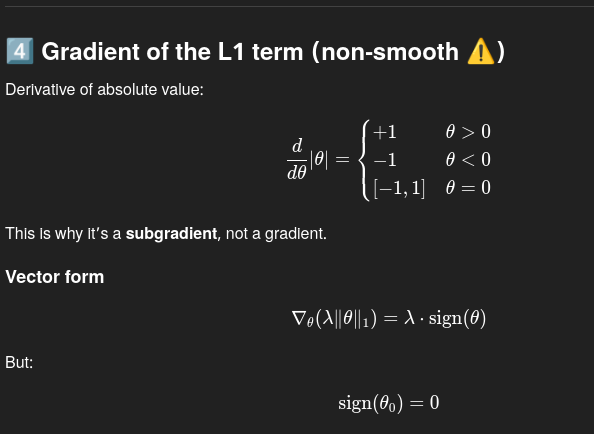
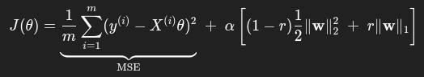

# Why SVD Works in Linear Regression (When the Normal Equation Fails)

## Overview

In linear regression, the objective is to estimate parameters \( \beta \) such that:

\[
y = X\beta
\]

Two common analytical approaches are:
- The **Normal Equation**
- **Singular Value Decomposition (SVD)**

Although the normal equation is mathematically valid, it often fails in real-world scenarios due to numerical instability. SVD provides a robust and stable alternative.

---

## The Normal Equation

The normal equation computes regression coefficients as:

\[
\hat{\beta} = (X^T X)^{-1} X^T y
\]

### Assumptions

This method assumes:
1. \(X^T X\) is invertible
2. The inversion process is numerically stable

If either assumption fails, the solution becomes unreliable.

---

## Why the Normal Equation Fails

### 1. Multicollinearity

When features in \(X\) are:
- highly correlated
- redundant
- nearly linearly dependent

then \(X^T X\) becomes **singular or nearly singular**, making inversion unstable or impossible.

---

### 2. Squared Condition Number

The condition number measures numerical sensitivity.

If:
\[
\kappa(X) = \text{condition number of } X
\]

then:
\[
\kappa(X^T X) = \kappa(X)^2
\]

This means the normal equation **amplifies numerical errors**, often leading to wildly incorrect coefficients.

---

## How SVD Solves the Problem

SVD decomposes the design matrix:

\[
X = U \Sigma V^T
\]

Using this decomposition, the regression solution becomes:

\[
\hat{\beta} = V \Sigma^{-1} U^T y
\]

---

## Why This Is Stable

### 1. No Matrix Inversion

- The normal equation inverts \(X^T X\)
- SVD only inverts **diagonal singular values**

This avoids catastrophic numerical instability.

---

### 2. Explicit Handling of Weak Directions

Each singular value \( \sigma_i \) represents the importance of a direction in feature space.

- Large \( \sigma_i \): informative direction
- Small \( \sigma_i \): noisy or redundant direction

SVD allows:
- truncation of small singular values
- controlled handling of rank-deficient data

---

## Geometric Interpretation

- **Normal Equation**: fits across all dimensions equally, even unstable ones
- **SVD**: rotates data into principal axes and fits only meaningful directions

SVD respects the true geometry of the data.

---

## Connection to Regularization

Ridge regression modifies the normal equation:

\[
(X^T X + \lambda I)^{-1}
\]

In SVD terms, this becomes:

\[
\frac{1}{\sigma_i^2 + \lambda}
\]

This shows that regularization **suppresses unstable directions**, which SVD naturally exposes.

---

## When the Normal Equation Is Acceptable

The normal equation may work when:
- features are independent
- the dataset is small
- \(X^T X\) is well-conditioned
- numerical precision is not critical

These conditions are rare in real-world data.

---

## Summary

| Method | Strengths | Weaknesses |
|------|----------|-----------|
| Normal Equation | Simple, closed-form | Unstable, fails with multicollinearity |
| SVD | Numerically stable, robust | Slightly more computational cost |

---

## Key Takeaway

**SVD works in regression because it decomposes the problem into stable, interpretable directions and avoids inverting ill-conditioned matrices, while the normal equation amplifies numerical errors.**


# Ridge Regression and Lasso Regression
## What is Regularization
Regularization is a statistical method to reduce errors caused by overfitting on training data. 

## Ridge Regression
Ridge regression—also known as L2 regularization—is one of several types of regularization for linear regression models. Ridge regression specifically corrects for multicollinearity in regression analysis. This is useful when developing machine learning models that have a large number of parameters, particularly if those parameters also have high weights.

| Term       | Role                            |
| ---------- | ------------------------------- |
| Data loss  | Fits the data                   |
| L2 penalty | Shrinks weights                 |
| (\lambda)  | Controls bias–variance tradeoff |

Note: The SGDRegressor in sklearn, can be set to use the Ridge regularization by setting the hyperparameter penalty=l2
The penalty hyperparameter sets the type of regularization term to use. Specifying
"l2" indicates that you want SGD to add a regularization term to the cost function
equal to half the square of the ℓ2 norm of the weight vector: this is simply Ridge
Regression.


## Lasso Regression
Lasso regression is a regularization technique that applies a penalty to prevent overfitting and enhance the accuracy of statistical models.

- Lasso stands for Least Absolute Shrinkage and Selection Operator
- Lasso Regression is also known as L-1 Regression
- Larger values of lambda increase the penalty, shrinking more of the coefficients towards zero; this subsequently reduces the importance of (or altogether eliminates) some of the features from the model, resulting in automatic feature selection. Conversely, smaller values of lambda reduce the effect of the penalty, retaining more features within the model.
- In lasso regression, the hyperparameter lambda (λ), also known as the L1 penalty, balances the tradeoff between bias and variance in the resulting coefficients
- As λ increases, the bias increases, and the variance decreases, leading to a simpler model with fewer parameters. Conversely, as λ decreases, the variance increases, leading to a more complex model with more parameters. If λ is zero, then one is left with an OLS function–that is, a standard linear regression model without any regularization.


## Gradient of the regularization
<!-- insert image -->



I’ll assume:

* Linear model
* Squared loss
* L1 regularization
* Intercept **not** regularized

---

# 1️⃣ Lasso objective (start from scratch)

[
J(\theta) ;=; \frac{1}{m}\sum_{i=1}^m (y_i - \hat{y}*i)^2 ;+; \lambda \sum*{j=1}^n |\theta_j|
]

Where:

* (\hat{y} = X\theta)
* (\theta_0) (intercept) is excluded
* (m) = number of samples

---

# 2️⃣ Split loss into two parts

### (A) MSE term

[
\frac{1}{m} | X\theta - y |_2^2
]

### (B) L1 penalty

[
\lambda \sum_{j=1}^n |\theta_j|
]

---

# 3️⃣ Gradient of the MSE (smooth part)

[
\nabla_\theta \left( \frac{1}{m}|X\theta - y|^2 \right)
=======================================================

\frac{2}{m} X^T(X\theta - y)
]

### Code

```python
predicted_y = X @ theta
residuals = predicted_y - y
grad_mse = 2 / m * (X.T @ residuals)
```

---

# 4️⃣ Gradient of the L1 term (non-smooth ⚠️)

Derivative of absolute value:

[
\frac{d}{d\theta} |\theta|
==========================

\begin{cases}
+1 & \theta > 0 \
-1 & \theta < 0 \
[-1, 1] & \theta = 0
\end{cases}
]

This is why it’s a **subgradient**, not a gradient.

### Vector form

[
\nabla_\theta (\lambda |\theta|_1)
==================================

\lambda \cdot \text{sign}(\theta)
]

But:
[
\text{sign}(\theta_0) = 0
]

---

### Code

```python
lasso_grad = alpha * np.sign(theta)
lasso_grad[0] = 0   # do NOT penalize intercept
```

---

# 5️⃣ Full gradient update (subgradient descent)

[
\theta \leftarrow \theta - \eta \left[
\frac{2}{m} X^T(X\theta - y) + \lambda \cdot \text{sign}(\theta)
\right]
]

### Code

```python
grad = grad_mse + lasso_grad
theta -= lr * grad
```

---

# 6️⃣ Cost function (for monitoring)

### Math

[
J(\theta) =
\frac{1}{m}(X\theta - y)^T(X\theta - y)
+
\lambda \sum_{j=1}^n |\theta_j|
]

### Code

```python
mse = (1 / m) * (residuals.T @ residuals)
lasso_penalty = alpha * np.sum(np.abs(theta[1:]))
cost = mse + lasso_penalty
```

---

# 7️⃣ Why coefficients become zero (intuition)

When a weight is small:

* MSE gradient pulls it slightly
* L1 gradient applies **constant force** toward zero
* Once near zero → it gets **stuck**

This is the sparsity effect.

---

# 8️⃣ Why gradient descent is unstable near zero

At (\theta = 0):

[
\text{sign}(0) \in [-1, 1]
]

In code:

```python
np.sign(0) == 0
```

But mathematically:

* Any value in [-1, 1] is valid
* Leads to oscillation
* Learning rate sensitive

This is why sklearn **does not** use GD.

---

# 9️⃣ The “correct” update (preview 👀)

Coordinate descent solves **one weight at a time**:

[
\theta_j \leftarrow
\text{soft-threshold}\left(
\frac{1}{m} X_j^T r, \lambda
\right)
]

Where:
[
\text{soft}(z, \lambda)
=======================

\begin{cases}
z - \lambda & z > \lambda \
0 & |z| \le \lambda \
z + \lambda & z < -\lambda
\end{cases}
]

We’ll derive this next if you want.

---

# 10️⃣ Summary (you should remember this)

* Lasso ≠ Ridge mathematically
* L1 → **subgradient**
* Subgradient GD is valid but unstable
* Sparsity comes from **constant pull to zero**
* Coordinate descent exists *because* of non-differentiability

---

# Elastic Net
Elastic Net is a middle ground between Ridge Regression and Lasso Regression. The
regularization term is a simple mix of both Ridge and Lasso’s regularization terms,
and you can control the mix ratio r. 

- When r = 0, Elastic Net is equivalent to Ridge
Regression,
- when r = 1, it is equivalent to Lasso Regression
- Ridge is a good default, but if you suspect that only a few features are actually useful, you should pre‐
fer Lasso or Elastic Net since they tend to reduce the useless features’ weights down to
zero as we have discussed.
- In general, Elastic Net is preferred over Lasso since Lasso
may behave erratically when the number of features is greater than the number of
training instances or when several features are strongly correlated.

## Why Elastic Net exists (intuition first)

Elastic Net was created to fix two practical problems you run into with Lasso and Ridge in the real world:

Lasso (L1) struggles when features are highly correlated

It tends to pick one feature and ignore the rest (arbitrary selection)

Ridge (L2) keeps all features

No sparsity → no feature selection

👉 Elastic Net combines both

 - Ridge’s stability

 - Lasso’s sparsity




### Error = Regression error + (regularization-factot) * Regularization term
